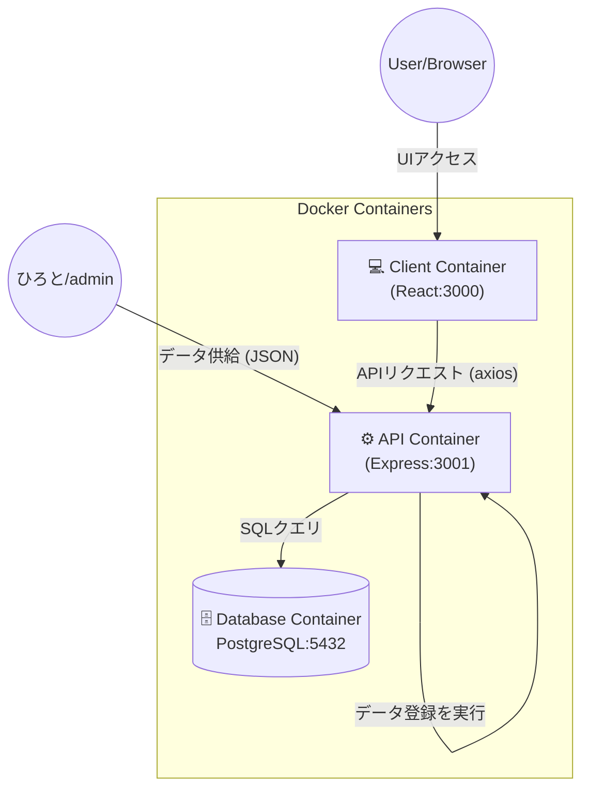

# 🎓 Syllabus Database System (PERN Stack)

一関高専のシラバスデータを統合・検索・閲覧するためのWebアプリケーションシステムです。
Dockerを用いて環境構築を行い、PostgreSQL, Express, React, Node.js (PERNスタック) で構成されています。

## 🏗 システム構成図

各コンテナはDockerネットワーク内で接続されています。


# 🛠 技術スタック

| カテゴリ | 技術 | 説明 |
| :--- | :--- | :--- |
| **Frontend** | React | ユーザーインターフェース |
| **Backend** | Express.js | REST APIサーバー |
| **Database** | PostgreSQL | リレーショナルデータベース |
| **Environment** | Docker / Compose | コンテナ仮想化環境 |

# 🚀 環境構築と起動方法

### 前提条件
* Docker Desktop がインストールされ、起動していること。

### 1. アプリケーションの起動
プロジェクトのルートディレクトリで以下のコマンドを実行します。

```bash
docker compose up --build -d
```
* 初回はビルドに数分かかります。
* -d オプションでバックエンド実行になります。
### 1. データベースのセットアップ (Seeding)
コンテナ起動後、JSONデータをデータベースに登録するために以下のコマンドを実行します。
```bash
docker compose exec api node seed.js
```
成功すると `✨ 全データの登録が完了しました！` と表示されます。
### 3. アクセスURL
* **Webアプリ**: http://localhost:3000
* **APIエンドポイント**: http://localhost:3001/api/subjects📂
# 📂データベース設計 (Schema)
データベース `syllabusdb` 内には以下のテーブルが作成されます。
### 1. `subjects` (科目テーブル)
   科目の基本情報を管理します。
   | 論理名 | 物理名 | データ型 | 制約 / 説明 |
| :--- | :--- | :--- | :--- |
| 科目ID | `subject_id` | SERIAL | **PRIMARY KEY**, 自動採番 |
| 学年 | `grade` | INTEGER | 対象学年 (1-5) |
| 学科 | `department` | VARCHAR(100) | 学科・系名 |
| 開設時期 | `semester` | VARCHAR(50) | 前期, 後期, 通年 など |
| 科目名 | `subject_name` | VARCHAR(200) | **NOT NULL** |
| 科目区分 | `subject_category` | VARCHAR(100) | 専門, 一般 など |
| 履修区分 | `registration_category` | VARCHAR(100) | 必修, 選択 など |
| 単位種別 | `credit_type` | VARCHAR(50) | 学修単位, 履修単位 |
| 単位数 | `credits` | INTEGER |  |
| 授業形態 | `class_format` | VARCHAR(50) | 講義, 演習, 実験 など |
| 分類 | `classification` | VARCHAR(100) | 必履修 など (JSON由来) |
| シラバスURL | `syllabus_url` | TEXT | 公式サイトへのリンク用パラメータ |
### 2. `instructors` (教員テーブル)
教員名を一意に管理します。
| 論理名 | 物理名 | データ型 | 制約 / 説明 |
| :--- | :--- | :--- | :--- |
| 教員ID | `instructor_id` | SERIAL | **PRIMARY KEY**, 自動採番 |
| 教員名 | `instructor_name` | VARCHAR(100) | **NOT NULL**, **UNIQUE** |
### 3. `subject_assignment` (担当割当テーブル)
科目と教員を多対多で紐付けます。
| 論理名 | 物理名 | データ型 | 制約 / 説明 |
| :--- | :--- | :--- | :--- |
| 割当ID | `assignment_id` | SERIAL | **PRIMARY KEY**, 自動採番 |
| 科目ID | `subject_id` | INTEGER | **Foreign Key** (Ref: subjects) |
| 教員ID | `instructor_id` | INTEGER | **Foreign Key** (Ref: instructors) |
# 💻 開発ガイド
### 📂 フォルダ構成
```text
.
├── docker-compose.yml  # Docker構成ファイル (コンテナ定義)
├── init.sql            # DB初期化SQL (テーブル作成・初期設定)
├── api/                # バックエンド (Node.js/Express)
│   ├── server.js       # APIサーバー本体
│   ├── seed.js         # データ登録用スクリプト
│   ├── package.json    # 依存ライブラリ定義
│   └── syllabas.json   # シラバスの元データ (JSON)
└── client/             # フロントエンド (React)
    ├── public/         # 静的ファイル
    └── src/
        ├── App.js      # メイン画面のロジック・表示
        └── App.css     # スタイルシート
```
### ⚡ よく使うコマンド
| 目的 | コマンド | 備考 |
| :--- | :--- | :--- |
| **コンテナ起動** | `docker compose up -d` | バックグラウンドで起動 |
| **再ビルドして起動** | `docker compose up --build -d` | パッケージ追加や設定変更時 |
| **ログ確認 (全体)** | `docker compose logs -f` | `Ctrl+C` で終了 |
| **ログ確認 (APIのみ)** | `docker compose logs -f api` | バックエンドのエラー確認 |
| **コンテナ停止** | `docker compose down` | コンテナを削除して停止 |
| **全データリセット** | `docker compose down -v` | DBデータも完全に消去 |
| **データ登録** | `docker compose exec api node seed.js` | JSONデータをDBに投入 |
# トラブルシューティング
### Q. サイトにアクセスできない / 画面が真っ白
  **A.** `docker compose ps` でコンテナが動いているか確認してください。`client` コンテナのログを確認し、コンパイルエラーがないかチェックしてください。
### Q. データベースエラーが出る / データが古い
  **A.** `init.sql` を変更した場合は、一度 `docker compose down -v` でボリュームを削除してから再起動してください。
